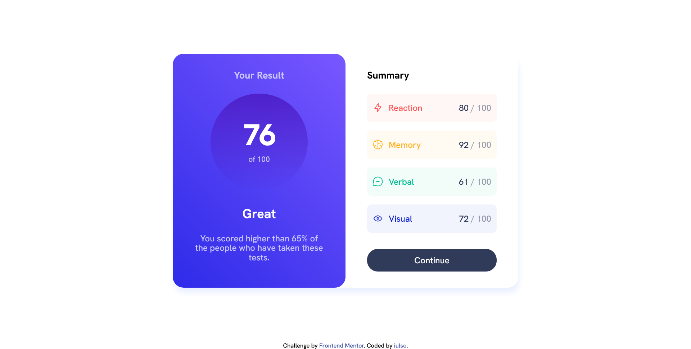

# Frontend Mentor - Results summary component solution

This is a solution to the [Results summary component challenge on Frontend Mentor](https://www.frontendmentor.io/challenges/results-summary-component-CE_K6s0maV). Frontend Mentor challenges help you improve your coding skills by building realistic projects.

## Table of contents

- [Overview](#overview)
  - [The challenge](#the-challenge)
  - [Screenshot](#screenshot)
  - [Links](#links)
- [My process](#my-process)
  - [Built with](#built-with)
  - [What I learned](#what-i-learned)

## Overview

### The challenge

Users should be able to:

- View the optimal layout for the interface depending on their device's screen size.
- See hover and focus states for all interactive elements on the page.

### Screenshot



### Links

- Live Site URL: [click here](https://iulso.github.io/fem-results-component/)

## My process

### Built with

- Semantic HTML5 markup
- CSS custom properties
- Flexbox
- CSS Grid
- Mobile-first workflow
- JavaScript

### What I learned

If you use `background-color` on a `button` and try to transition to a gradient using `background`, it will show a flash because all the `background` properties are reset and the color will become transparent. To avoid this unwanted behaviour, you can use a similar configuration as the one you are trying to transition. In this case, I used a `linear-gradient` as a way of setting the solid color to ensure a smoth transition of the gradient on hover:

```css
.btn {
  background: linear-gradient(var(--dark), var(--dark));
  transition: all 150ms ease-in-out;

  &:hover {
    background: var(--bg-gradient);
  }
}
```

I used JavaScript to fetch the data from a JSON file and generate the HTML elements. See the file in this directory: app/js/script.js
